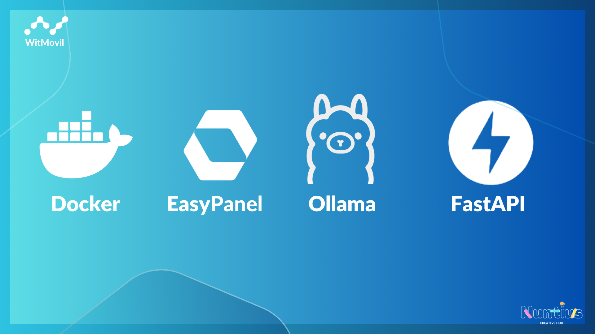

# Ollama en Docker

Este repositorio proporciona un Dockerfile y una guía para desplegar Ollama con FastAPI utilizando Docker. Ollama es un microservicio para la generación de texto utilizando modelos de lenguaje. Esta guía te ayudará a configurar y ejecutar tu propio servicio de generación de texto en un entorno Docker.



## Requisitos Previos

Asegúrate de tener instalado lo siguiente:

- [Docker](https://www.docker.com/get-started) (versión recomendada: 20.10 o superior)
- [Docker Compose](https://docs.docker.com/compose/install/) (opcional, pero recomendado para facilitar la gestión de contenedores)

## Estructura del Proyecto
/tu-proyecto ├── Dockerfile ├── app.py └── requirements.txt
## Instalación

1. **Clona el repositorio:**

   ```bash
   git clone https://github.com/nuntius-dev/ollama.git
   cd ollama
   ```
2. **Construye la imagen de Docker:**
   ```bash
   docker build -t ollama-fastapi .
   ```
3. Ejecuta el contenedor en modo interactivo:
   ```bash
   docker run -p 80:80 ollama-fastapi
   ```
## Uso
Una vez que el contenedor se esté ejecutando, puedes acceder a la API de Ollama en http://localhost:80.

Rutas de la API
- GET /: Retorna un mensaje de bienvenida.

## Ejemplo de respuesta:
  ```bash
  {
      "message": "Bienvenido a la API de TinyLlama"
  }
  ```
- POST /generate: Genera texto basado en un prompt.

## Ejemplo de solicitud:
  ```bash
  {
      "prompt": "Escribe un cuento sobre un dragón."
  }
  ```
- POST /generate: Genera texto basado en un prompt.

## Ejemplo de respuesta:
  ```bash
  {
      "generated_text": "Había una vez un dragón que..."
  }
  ```
# Configuración
Puedes modificar el archivo app.py para personalizar el comportamiento de la API. Asegúrate de instalar las dependencias necesarias en el entorno Docker. El Dockerfile incluye las dependencias de Python requeridas.

Dependencias: Asegúrate de que las principales bibliotecas, como FastAPI, transformers y torch, están correctamente instaladas en tu Dockerfile.
# Advertencias
Asegúrate de que tu servidor tenga suficientes recursos (RAM y CPUs) para ejecutar el modelo de generación de texto, especialmente cuando uses modelos grandes.
Este proyecto debe ser ejecutado en un entorno seguro si planeas exponer la API a Internet.
Contribuciones
Las contribuciones son bienvenidas. Si tienes alguna mejora o corrección, no dudes en abrir un issue o una pull request.

# Licencia
Este proyecto tiene licencia bajo la MIT License
### Consideraciones Finales

1. **Personaliza los enlaces:** Asegúrate de cambiar `tu-usuario` y `tu-repo` por tus propios datos de GitHub.
2. **Modifica ejemplos y textos:** Ajusta cualquier texto según lo que consideres necesario para que se ajuste a tu proyecto específico.
3. **Agrega cualquier otra sección** que creas necesaria, como `Descripción detallada`, `Ejemplos adicionales`, `FAQ`, etc.

Este `README.md` proporciona información básica y debería ser un buen punto de partida para tu proyecto. ¡Si necesitas más ayuda, no dudes en preguntar!

Si quieres saber como instalarlo en docker sigue esta guia: [https://bit.ly/3CPLAyI](https://witmovil.com/guia-rapida-para-instalar-ollama-en-docker-easypanel-fastapi/)


